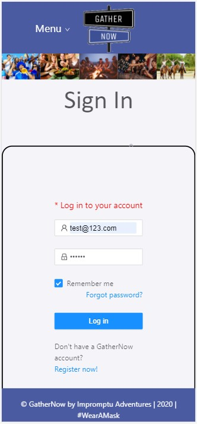

  # GatherNow
### Deployed link: https://gather-now.herokuapp.com/
  ## Project Creators: 
  ### Cassandra, Ricky, Mike, Hannibal, Anthony
---
  
  ## Project Description:
  ### GatherNow is an interactive/mobile first app tailored for the spontaneous individual looking for Impromptu Adventurers, locally. The app is designed so users can sign-in and post or join impromptu local activies on an individual or small group basis within a 24 hour time slot. Are you new in town, perhaps interested in meeting new friends, or maybe a new hobby and would like to meet other like-minded individuals but short on time?  GatherNow is your gateway to an Impromptu Adventure!

  
---
 
  ## Table of Contents
  1. [Installation](#Installation)
  2. [Usage](#Usage)
  3. [Contributing](#Contributing)
  4. [Links](#Links)
  5. [Email](#Contact)
  
  ---

  ## Installation:
  ## Developers please see the package.json file and then run NPM install on your command line.

  ---      

  ## Usage:

  * Starting on the home page anyone can sign-up/sign-in and create spontaneous events that will occur within the next 24 hours. Alternatively users can just scroll and search current events that other users posted.
  
  * If the user does not have an account they will need to follow the Create Account link on the top left of the page and fill out the Create Account form.
  * Once the user has created an account they will need to log in.
    * After logging in, the user is brought to the Home Page where they can scroll through a list of currently posted events by other users.
    * Signed-in users can also click on MyAccount to go to a dashboard that shows user bio, events the user has selected, and other user profile information.
    *  go to a dashboard that shows user bio, events the user has selected, and other user profile information. You will be able to review, delete, and respond to events that you have selected as well as create and post a new event.
  * You will be able to review, delete, and respond to events that you have selected as well as create and post a new event.  Don't forget to stop by the Dev Team page to see who the masterminds behind GatherNow!

  ---
 
 ## Contributing:
 ## Cass, Ricky, Hannibal, Mike, and Anthony from the Dev Team page.
---

 ## Links

  * linkedIn: 
    * Cassandra Chamberlain: https://www.linkedin.com/in/cassandra-chamberlain-875794166/ 
    * Ricky Garcia: https://www.linkedin.com/in/enrique-garcia-30353715a/ 
    * Mike Shenk: https://www.linkedin.com/in/michaelshenk415/ 
    * Hannibal Wyman: www.linkedin.com/in/hannibal-wyman-17068926/ 
    * Anthony Perez: https://www.linkedin.com/in/anthony-perez-5040b2a4/ 

        
  * Github:
    * GatherNow: https://gather-now.herokuapp.com/ 
    * Ricky Garcia: https://github.com/rickyg218 
    * Hannibal Wyman: https://github.com/AychDubya 
    * Mike Shenk: https://github.com/mlshenk 
    * Anthony Perez: https://github.com/ajper05/

  ---

  ## Contact
 
  ## If you have any questions, contact the author directly at: 
  ### cssndrchmbrl25@gmail.com 
  ### Rickyg218@gmail.com

---
### 
  [Back to the top](#GatherNow)
### or check out the app: GatherNow: https://gather-now.herokuapp.com/ 
  
  

